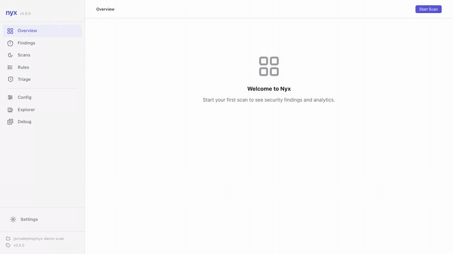

<div align="center">
  

**A local-first security scanner with a browser UI. Scan your repo and triage in your browser, with no cloud and no account.**

[](https://crates.io/crates/nyx-scanner)
[](https://www.gnu.org/licenses/gpl-3.0)
[](https://www.rust-lang.org)
[](https://github.com/elicpeter/nyx/actions)
</div>

<p align="center"></p>

---

## Scan locally, browse locally

Nyx runs a cross-language taint analysis on your repository, then serves the results to a React UI bound to `127.0.0.1`. You get a finding list with severity, evidence, and a step-by-step **flow visualiser** that walks the dataflow from source → sanitizer → sink. Triage decisions persist to `.nyx/triage.json`, which commits alongside your code so the team shares one triage state.

```bash
cargo install nyx-scanner
nyx scan           # runs the analyzer, caches findings in .nyx/
nyx serve          # opens http://localhost:9700 in your browser
```

Everything stays on your machine: loopback-only bind, host-header enforcement, CSRF on every mutation, no telemetry, no login.

<!-- SCREENSHOT: assets/screenshots/overview.png: OverviewPage dashboard (top findings, stats, engine profile) -->

---

## What's in the UI

| Page | What it shows |
|---|---|
| **Overview** | Dashboard: finding counts by severity, top offenders, engine profile summary |
| **Findings** | Browsable list with severity badges, triage status, rule filter, language filter |
| **Finding detail** | Flow-path visualiser with numbered steps (source → sanitizer → sink), code snippets, evidence, cross-file markers, triage dropdown |
| **Triage** | Bulk update states (open, investigating, fixed, false_positive, accepted_risk, suppressed), audit trail, import/export JSON |
| **Explorer** | File tree with per-file symbol list and finding overlay |
| **Scans** | Run history, metrics, diff two scans to see what changed |
| **Rules** | Built-in and custom rules per language; add rules from the UI |
| **Config** | Live config editor; reload without restart |

<!-- SCREENSHOT: assets/screenshots/finding-detail.png: FindingDetailPage flow visualiser (THIS is the money shot) -->
<!-- SCREENSHOT: assets/screenshots/triage.png: TriagePage bulk actions + audit log -->
<!-- SCREENSHOT: assets/screenshots/explorer.png: ExplorerPage file tree + symbol list -->

`nyx serve` flags: `--port <N>` (default `9700`), `--host <addr>` (loopback only: `127.0.0.1`, `localhost`, or `::1`), `--no-browser`. See `[server]` in `nyx.conf` for persistent settings.

---

## CLI for CI

The same engine runs headless for CI pipelines. SARIF output uploads directly to GitHub Code Scanning.

```bash
# Fail the job on medium or higher, emit SARIF
nyx scan --format sarif --fail-on MEDIUM > results.sarif

# Ad-hoc JSON, no index
nyx scan ./server --format json --index off

# AST patterns only (fastest; skips CFG + taint)
nyx scan --mode ast
```

### GitHub Action

```yaml
- uses: elicpeter/nyx@v0.5.0
  with:
    format: sarif
    fail-on: MEDIUM
- uses: github/codeql-action/upload-sarif@v3
  with:
    sarif_file: nyx-results.sarif
```

Inputs: `path`, `version`, `format` (`sarif`|`json`|`console`), `fail-on`, `args`, `token`. Outputs: `finding-count`, `sarif-file`, `exit-code`, `nyx-version`. Linux and macOS runners (x86_64, ARM64).

---

## Install

**Cargo (recommended):**
```bash
cargo install nyx-scanner
```

**Pre-built binaries:** Grab the archive for your platform from [Releases](https://github.com/elicpeter/nyx/releases), verify against `SHA256SUMS` (and the detached `SHA256SUMS.asc` GPG signature, when present), unzip, and drop `nyx` on your `PATH`.

```bash
# Optional: verify the checksum file's GPG signature (when SHA256SUMS.asc is published)
gpg --verify SHA256SUMS.asc SHA256SUMS
sha256sum -c SHA256SUMS --ignore-missing
unzip nyx-x86_64-unknown-linux-gnu.zip && chmod +x nyx && sudo mv nyx /usr/local/bin/
```

**From source:**
```bash
git clone https://github.com/elicpeter/nyx.git
cd nyx && cargo build --release
```

Requires stable Rust 1.88+. The frontend is compiled and embedded in the binary at build time, so there is no separate install step for `nyx serve`.

---

## Languages

All 10 languages parse via tree-sitter and run through the full pipeline, but rule depth is uneven. Tiers reflect benchmark F1 on the 273-case corpus at [`tests/benchmark/ground_truth.json`](tests/benchmark/ground_truth.json):

| Tier | Languages | F1 | Use as a CI gate? |
|---|---|---|---|
| **Stable** | Python, JavaScript, TypeScript | 96.8% to 100% | Yes |
| **Beta** | Go, Java, Ruby, PHP | 92.9% to 97.0% | Yes, with light FP triage |
| **Preview** | C, C++ | 88.9% to 92.3% | No. Pair with clang-tidy or Clang Static Analyzer |
| **Experimental** | Rust | 86.4% | Review findings, don't block merges |

Per-dimension detail and known blind spots live in [`docs/language-maturity.md`](docs/language-maturity.md).

---

## How it works

Two passes over the filesystem, with an optional SQLite index to skip unchanged files:

1. **Pass 1**: parse each file via tree-sitter, build an intra-procedural CFG (petgraph), lower to pruned SSA (Cytron phi insertion over dominance frontiers), and export per-function summaries (source/sanitizer/sink caps, taint transforms, points-to, callees).
2. **Summary merge**: union all per-file summaries into a `GlobalSummaries` map.
3. **Pass 2**: re-analyze each file with full cross-file context. A forward dataflow worklist propagates taint through the SSA lattice with guaranteed convergence. Call-graph SCCs iterate to fixed-point so mutually recursive functions get accurate summaries.
4. **Rank, dedupe, emit**: findings are scored by severity × evidence strength × source-kind exploitability, then emitted to console, JSON, or SARIF.

Detector families: taint (cross-file source→sink), CFG structural (auth gaps, unguarded sinks, resource leaks), state model (use-after-close, double-close, must-leak, unauthed-access), AST patterns (tree-sitter structural match). Full detector docs: [`docs/detectors.md`](docs/detectors.md).

---

## Configuration

Config merges `nyx.conf` (defaults) and `nyx.local` (your overrides) from the platform config directory (`~/.config/nyx/` on Linux, `~/Library/Application Support/nyx/` on macOS, `%APPDATA%\elicpeter\nyx\config\` on Windows).

```toml
[scanner]
mode         = "full"        # full | ast | cfg | taint
min_severity = "Medium"

[server]
host = "127.0.0.1"
port = 9700
open_browser = true

# Project-specific sanitizer
[[analysis.languages.javascript.rules]]
matchers = ["escapeHtml"]
kind     = "sanitizer"
cap      = "html_escape"
```

Or add rules interactively: `nyx config add-rule --lang javascript --matcher escapeHtml --kind sanitizer --cap html_escape`. Full schema: [`docs/configuration.md`](docs/configuration.md).

---

## Status

Under active development. APIs, detector behavior, and configuration options may change between releases. Rule-level F1 on the 273-case corpus is the CI regression floor; per-language detail lives in [`tests/benchmark/RESULTS.md`](tests/benchmark/RESULTS.md).

Limitations:
- Taint analysis is intra-procedural with cross-file summaries, not fully inter-procedural.
- Cross-language interop edges must be configured explicitly.
- Not all language features are modeled (macros, dynamic dispatch, aliased imports).
- Results may contain false positives or false negatives; manual review is expected.

---

## Documentation

- [Installation](docs/installation.md) · [Quick Start](docs/quickstart.md) · [CLI Reference](docs/cli.md)
- [Configuration](docs/configuration.md) · [Output Formats](docs/output.md)
- [Detectors](docs/detectors.md): [Taint](docs/detectors/taint.md), [CFG](docs/detectors/cfg.md), [State](docs/detectors/state.md), [AST Patterns](docs/detectors/patterns.md)
- [Rule Reference](docs/rules/index.md) · [Language Maturity](docs/language-maturity.md) · [Advanced Analysis](docs/advanced-analysis.md)

---

## Contributing

Pull requests welcome. Run `cargo fmt`, `cargo clippy --all -- -D warnings`, and `cargo test` before submitting. See [`CONTRIBUTING.md`](CONTRIBUTING.md) for the full guide including how to add rules and support new languages. Open an issue for crashes, panics, or suspicious results; attach a minimal snippet and the Nyx version.

---

## License

GNU General Public License v3.0 or later (GPL-3.0-or-later). The optional `smt` feature bundles Z3 (MIT-licensed); distributors of binaries built with `--features smt` should include Z3's license in their attribution. Full text in [LICENSE](./LICENSE); third-party dependencies in [THIRDPARTY-LICENSES.html](./THIRDPARTY-LICENSES.html).
