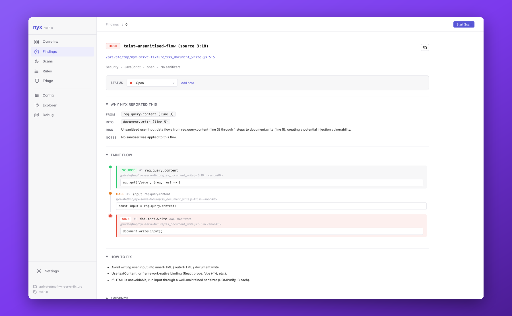

# Taint analysis

Nyx tracks untrusted data from **sources** (where it enters the program) through assignments and function calls to **sinks** (where it's used dangerously). If the flow reaches a sink without passing a matching **sanitizer**, a finding fires.

The engine is a monotone forward dataflow over a finite lattice with guaranteed termination. It's flow-sensitive inside a function, and interprocedural across files via persisted per-function summaries.

## Rule ID

```
taint-unsanitised-flow (source <line>:<col>)
```

One rule ID, parameterized by the source location. Suppressions can target either the base ID or the full string.

## What it detects

- User input flowing to shell execution: `req.body.cmd` → `child_process.exec`
- User input flowing to code evaluation: `req.query.code` → `eval`
- User input flowing to SQL: `request.args.get('id')` → `cursor.execute(f"... {id}")`
- Environment variables flowing to shell: `env::var("CMD")` → `Command::new("sh").arg("-c")`
- Request parameters flowing to HTML: `req.query.name` → `innerHTML`
- File contents flowing to privileged sinks: `fs::read_to_string` → `db.execute`
- Any other source-to-sink flow where the sink's required capability is not stripped along the way

## What it can't detect

- **Library calls without summaries.** If a callee has no summary (no source, binary-only dependency), Nyx treats it as neither propagating nor sanitizing. This is conservative for sanitization but lossy for propagation.
- **Taint through struct fields and containers.** Taint attaches to whole variables. `obj.field = tainted; sink(obj.other_field)` can produce a false positive because `obj` itself is tainted.
- **Aliasing.** `let y = &x; sink(*y)` tracks `y` separately from `x`. Can cause FNs.
- **Implicit flows.** Taint follows explicit data, not branching signal. `if (secret) x = 1 else x = 0` does not taint `x`.
- **Globals and statics across functions.** Not tracked across function boundaries.

## Common false positives

| Scenario | Why | Mitigation |
|---|---|---|
| Custom sanitizer not recognised | Only built-in + configured sanitizers match | Add a custom sanitizer rule in config |
| Taint through struct fields | Variable-level tracking, not field-level | No fix yet; field-sensitivity is planned |
| Dead branches | Path-insensitive within a function | Constraint solving catches trivially infeasible combos; path-validated findings are scored lower |
| Library wrapper re-introduces taint | Wrapper opaque, or summary marks it as propagating | Summarize the wrapper explicitly or add it as a sanitizer |

## Common false negatives

| Scenario | Why |
|---|---|
| Third-party library on the path | No summary available, callee treated opaquely |
| Globals / statics across function boundaries | Not tracked |
| Some closure captures | Closure analysis is limited. JS/TS/Ruby/Go anonymous functions passed as callbacks *are* analyzed as separate scopes |
| Very deep cross-file chains | Summary approximation loses precision at depth |

## Confidence signals

Higher confidence:
- Source + Sink both present in evidence with specific call locations.
- `source_kind: user_input` (direct attacker control).
- `path_validated: false`.
- No dominating guard on the path.
- Symex produced a witness string (rendered sink value visible in JSON/SARIF `evidence.symbolic.witness`).

Lower confidence:
- Path-validated taint (`path_validated: true`).
- Source is a database read or internal file (pre-validated at insertion is common).
- Engine note `ForwardBailed` / `PathWidened`. Use `--require-converged` to drop these in strict gates.

## Tuning

### Custom sanitizer

```toml
# nyx.local
[[analysis.languages.javascript.rules]]
matchers = ["escapeHtml", "sanitizeInput"]
kind     = "sanitizer"
cap      = "html_escape"
```

Or: `nyx config add-rule --lang javascript --matcher escapeHtml --kind sanitizer --cap html_escape`.

### Filter by severity or confidence

```bash
nyx scan . --severity HIGH
nyx scan . --min-confidence medium
```

### Skip dataflow entirely

```bash
nyx scan . --mode ast
```

AST-only mode gives you structural pattern matches without taint.

In the browser UI, taint findings render as a numbered flow walk so you can see each hop the engine took:

<p align="center"></p>

## Example

Rust:

```rust
use std::env;
use std::process::Command;

fn main() {
    let cmd = env::var("USER_CMD").unwrap();           // source
    Command::new("sh").arg("-c").arg(&cmd).output();   // sink
}
```

Finding:

```
[HIGH] taint-unsanitised-flow (source 5:15)  src/main.rs:6:5
       Unsanitised user input flows from env::var → Command::new
       Source: env::var (5:15)
       Sink:   Command::new
```

Safe rewrite: drop the shell and pass the value as argv directly (`Command::new(&cmd).output()`), or validate against an allowlist before passing to the shell.

## Capabilities

Sources, sanitizers, and sinks are linked by named capabilities. A sanitizer only clears taint for the cap it declares. A sink only fires when the remaining taint still carries its required cap.

| Capability | Typical source | Typical sanitizer | Typical sink |
|---|---|---|---|
| `env_var` | `env::var`, `getenv`, `process.env` | | |
| `html_escape` | | `html.escape`, `DOMPurify.sanitize` | `innerHTML`, `document.write` |
| `shell_escape` | | `shlex.quote`, `shell_escape::escape` | `system`, `Command::new`, `eval` |
| `url_encode` | | `encodeURIComponent` | `location.href`, HTTP client URL arg |
| `json_parse` | | `JSON.parse` | |
| `file_io` | | `os.path.realpath`, `filepath.Clean` | `open`, `fs::read_to_string`, `send_file` |
| `fmt_string` | | | `printf(var)` |
| `sql_query` | | parameterized query binders | `cursor.execute`, `db.query` with concatenation |
| `deserialize` | | | `pickle.loads`, `yaml.load`, `Marshal.load` |
| `ssrf` | | URL-prefix locks | `requests.get`, `fetch`, `HttpClient.send` |
| `code_exec` | | | `eval`, `exec`, `Function` |
| `crypto` | | | weak-algorithm constructors |
| `unauthorized_id` | request-bound scoped IDs (Rust auth analysis) | ownership check | row-level write |
| `all` | Sources typically use `all` so they match any sink | | |

Sources typically use `cap = "all"` so they match every sink. Sinks declare the specific cap they need. Sanitizers only clear the cap they name.
